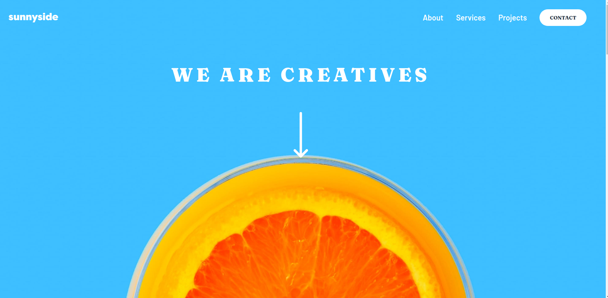

# Frontend Mentor - Sunnyside agency landing page solution

This is a solution to the [Sunnyside agency landing page challenge on Frontend Mentor](https://www.frontendmentor.io/challenges/sunnyside-agency-landing-page-7yVs3B6ef). Frontend Mentor challenges help you improve your coding skills by building realistic projects.

## Table of contents

- [Frontend Mentor - Sunnyside agency landing page solution](#frontend-mentor---sunnyside-agency-landing-page-solution)
  - [Table of contents](#table-of-contents)
    - [Screenshot](#screenshot)
    - [Links](#links)
  - [My process](#my-process)
    - [Built with](#built-with)
    - [What I learned](#what-i-learned)
    - [Continued development](#continued-development)
    - [Useful resources](#useful-resources)
  - [Author](#author)

### Screenshot

### Links

- Solution URL: [{code}](https://github.com/heterotopia52/front-End-Mentor/blob/master/sunnyside-agency-landing-page/index.html)
- Live Site URL: [live](https://heterotopia52.github.io/front-End-Mentor/sunnyside-agency-landing-page/index.html)
  
## My process

### Built with

- Semantic HTML5 markup
- Flexbox
- Mobile-first workflow

### What I learned

- Flexbox.

### Continued development

Flexbox mastery.

### Useful resources

- [Devdocs.io](https://devdocs.io) - Always open when coding.

## Author

- Frontend Mentor - [@beterotopia52](https://www.frontendmentor.io/profile/heterotopia52)
