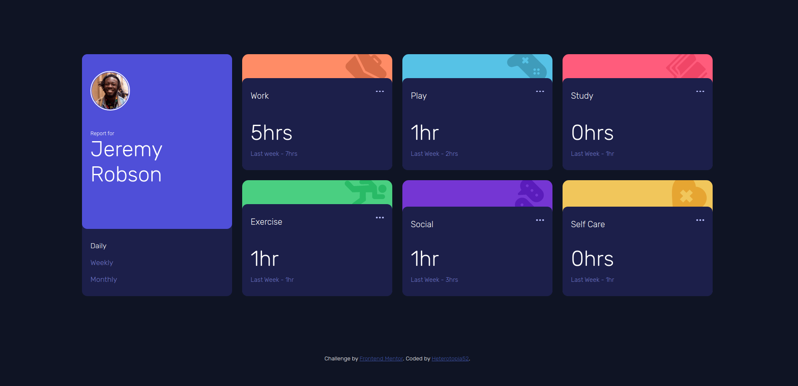

# Frontend Mentor - Time tracking dashboard solution

This is a solution to the [Time tracking dashboard challenge on Frontend Mentor](https://www.frontendmentor.io/challenges/time-tracking-dashboard-UIQ7167Jw). Frontend Mentor challenges help you improve your coding skills by building realistic projects.

## Table of contents

- [Frontend Mentor - Time tracking dashboard solution](#frontend-mentor---time-tracking-dashboard-solution)
  - [Table of contents](#table-of-contents)
  - [Overview](#overview)
    - [The challenge](#the-challenge)
    - [Screenshot](#screenshot)
    - [Links](#links)
  - [My process](#my-process)
    - [Built with](#built-with)
    - [What I learned](#what-i-learned)
    - [Continued development](#continued-development)
    - [Useful resources](#useful-resources)
  - [Author](#author)
  - [Acknowledgments](#acknowledgments)

## Overview

### The challenge

Users should be able to:

- View the optimal layout for the site depending on their device's screen size
- See hover states for all interactive elements on the page
- Switch between viewing Daily, Weekly, and Monthly stats

### Screenshot

### Links

- Solution URL: [{code}](https://github.com/heterotopia52/front-End-Mentor/blob/master/time-tracking-dashboard/index.html)
- Live Site URL: [live](https://heterotopia52.github.io/front-End-Mentor/time-tracking-dashboard/index.html)

## My process

### Built with

- Semantic HTML5 markup
- Flexbox
- CSS Grid
- Mobile-first workflow

### What I learned

- Flexbox && Grid.

### Continued development

Flexbox and Grid mastery.

### Useful resources

- [Devdocs.io](https://devdocs.io) - Always open when coding.

## Author

- Frontend Mentor - [@beterotopia52](https://www.frontendmentor.io/profile/heterotopia52)
  
## Acknowledgments

[@mikeyxx](https://github.com/mikeyxx) for ideas.
